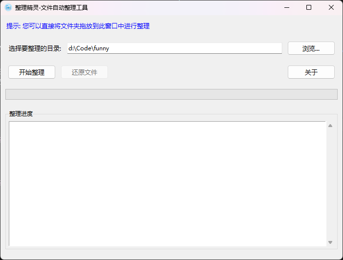
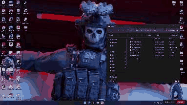

# 整理精灵-文件自动整理工具 📂

[](https://www.python.org/)
[]()
[]()

> 一键整理杂乱文件，让您的文件夹井井有条！

这是一个功能强大且易于使用的文件整理工具，可以根据文件类型自动将文件分类到不同的文件夹中，并支持一键还原功能。

---

## ✨ 功能特点

- 🔍 **智能分类** - 自动识别常见文件类型，包括图片、文档、视频等
- 📁 **自动归档** - 创建分类文件夹并将文件移动到对应位置
- 🔄 **冲突处理** - 自动处理文件名冲突，添加时间戳确保不会覆盖文件
- 🖥️ **多种界面** - 提供图形界面和命令行两种使用方式
- 📊 **实时进度** - 直观显示整理进度和状态
- ⏪ **一键还原** - 支持将整理过的文件恢复到原始位置，并自动删除空文件夹
- 🔒 **安全可靠** - 只移动文件，不会删除任何内容
- 🖱️ **拖放支持** - 直接将文件夹拖入程序窗口即可开始整理

---

## 📋 文件分类明细

| 分类 | 支持的文件类型 |
|------|--------------|
| 📷 **图片** | .jpg, .jpeg, .png, .gif, .bmp, .svg, .webp, .tiff, .tif, .raw, .heic, .ico, .psd, .ai, .eps, .cr2, .nef, .arw, .dng |
| 📝 **文档** | .doc, .docx, .pdf, .txt, .rtf, .xls, .xlsx, .ppt, .pptx, .odt, .ods, .odp, .csv, .md, .epub, .mobi, .azw, .azw3, .djvu, .xps, .pages, .numbers, .key, .tex, .log |
| 🎬 **视频** | .mp4, .avi, .mkv, .mov, .wmv, .flv, .webm, .m4v, .mpg, .mpeg, .3gp, .m2ts, .vob, .ts, .mts, .asf, .rm, .rmvb, .ogv, .divx |
| 🎵 **音频** | .mp3, .wav, .flac, .aac, .ogg, .m4a, .wma, .opus, .alac, .aiff, .ape, .mid, .midi, .amr, .ac3, .dts, .ra, .mka, .mpc, .gsm |
| 📦 **压缩文件** | .zip, .rar, .7z, .tar, .gz, .bz2, .xz, .iso, .tgz, .tbz2, .lzma, .cab, .jar, .war, .bz, .lz, .lzh, .arj, .z, .deb, .rpm, .pkg |
| 💻 **代码** | .py, .js, .html, .css, .java, .cpp, .c, .h, .json, .xml, .php, .rb, .swift, .kt, .go, .rs, .ts, .dart, .lua, .pl, .sh, .bat, .ps1, .sql, .yaml, .yml, .toml, .ini, .config, .jsx, .tsx, .vue, .cs, .vb, .scala, .groovy, .coffee, .scss, .sass, .less |
| ⚙️ **可执行文件** | .exe, .msi, .app, .dmg, .apk, .bin, .com, .run, .msc, .action, .command, .gadget, .vb, .vbs, .vbe, .jse, .ws, .wsf, .wsh, .scr |
| 🔤 **字体** | .ttf, .otf, .woff, .woff2, .eot, .pfb, .pfm, .fon, .bdf, .fnt, .pfa, .afm, .pcf |
| 🧊 **3D模型** | .obj, .stl, .fbx, .blend, .dae, .3ds, .max, .c4d, .mb, .ma, .lwo, .lws, .skp, .ply, .x3d, .gltf, .glb, .vrml, .x |
| 🎨 **设计文件** | .psd, .ai, .indd, .xd, .sketch, .fig, .xcf, .cdr, .sai, .psb, .afdesign, .afphoto, .aep, .prproj, .aepx, .ppj, .drw, .dgn, .dwg, .dxf |
| 🗄️ **数据库** | .db, .sqlite, .sqlite3, .mdb, .accdb, .dbf, .sql, .bak, .csv, .tsv, .dat, .xml, .json, .bson |
| 📄 **其他** | 不属于上述类别的所有其他文件类型 |

---

## 🚀 使用方法

### 系统要求

- Python 3.6 或更高版本
- tkinter 库（大多数 Python 安装中已包含）
- tkinterdnd2 库（可选，用于启用拖放功能）
- PIL/Pillow 库（可选，用于显示美观的图标）

### 安装依赖

```bash
# 使用pip安装拖放支持和图像处理库
pip install tkinterdnd2
pip install pillow
```

### 图形界面版本

1. 下载 `file_organizer.py` 文件
2. 运行脚本：
   ```bash
   python file_organizer.py
   ```
3. 在打开的图形界面中操作：

   

   - 输入或浏览选择要整理的目录
   - 或者直接将文件夹拖放到窗口中
   - 点击"开始整理"按钮
   - 在下方窗口查看整理进度
   - 进度条显示当前整理完成百分比

### 演示视频

查看以下演示GIF，了解工具的基本功能和使用流程：



完整演示视频可在本地查看`整理精灵.mp4`，包含以下内容：
- 工具界面详细介绍
- 文件整理过程完整演示
- 文件还原功能操作演示
- 拖放功能使用方法

### 文件夹拖放功能

1. 直接从资源管理器或文件浏览器中拖动文件夹
2. 放置到程序窗口的任意位置
3. 程序会自动将该文件夹路径设置为要整理的目录
4. 点击"开始整理"按钮后，程序会询问是否确认整理
5. 确认后自动开始整理过程

### 文件还原功能

1. 选择之前整理过的目录
2. 点击"还原文件"按钮
3. 在弹出的对话框中选择要还原的整理记录
4. 确认后，程序会自动执行以下操作：
   - 将所有文件移回原始位置
   - 自动删除创建的空分类文件夹
   - 如果分类文件夹中仍有其他文件，则保留该文件夹
5. 可以在窗口中查看还原进度和删除的文件夹信息

### 命令行版本

如果您偏好使用命令行，可以直接在Python代码中调用相关函数：

```python
# 整理文件
import file_organizer
file_organizer.organize_files("/path/to/directory")

# 还原文件
import file_organizer
file_organizer.restore_files("/path/to/directory")
```

---

## ⚠️ 注意事项

- 首次运行前建议备份重要文件
- 软件只会移动文件，不会删除任何内容
- 还原操作会删除空的分类文件夹，但不会删除非空文件夹
- 如果目标文件夹中已存在同名文件，将自动添加时间戳以避免覆盖
- 整理大量文件可能需要一些时间，请耐心等待
- 整理历史记录保存在目录下的隐藏文件 `.organize_history.json` 中
- 如果文件在还原前被移动或删除，将无法恢复到原始位置
- 拖放功能需要安装tkinterdnd2库，如未安装则自动禁用此功能

---

## 🔧 高级用法

### 自定义文件类型

如果需要自定义文件类型分类，可以修改代码中的 `file_types` 字典：

```python
file_types = {
    '图片': ['.jpg', '.jpeg', '.png', ...],
    '自定义类别': ['.自定义扩展名1', '.自定义扩展名2', ...],
    # 添加更多自定义类别...
}
```

### 批量处理多个目录

可以使用循环处理多个目录：

```python
import file_organizer

directories = ['/path/to/dir1', '/path/to/dir2', '/path/to/dir3']
for directory in directories:
    file_organizer.organize_files(directory)
```

---

## 📝 开发计划

- [x] 添加文件夹拖放功能
- [ ] 添加更多自定义选项
- [ ] 增加文件预览功能
- [ ] 支持按日期/大小等其他标准整理
- [ ] 开发跨平台安装包

---

## 🤝 贡献

欢迎提出建议和改进意见！如果您有任何问题或想法，请随时联系作者。

## 📄 许可

此项目采用 MIT 许可证 - 详情请参阅 LICENSE 文件

